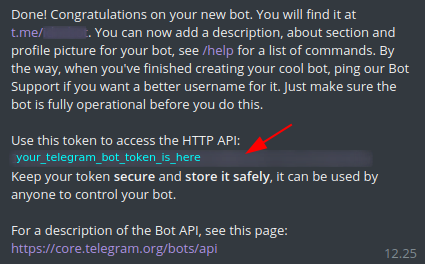

# Telegram bot sederhana dengan R

Repositori ini menyimpan contoh Telegram Bot sederhana yang bisa dijalankan di laptop yang terinstal R dan beberapa *package* pendukungnya.

## Fungsi

Dapat menjalankan fungsi:

-   `/start` untuk menampilkan pesan "hello"

-   `/caps <pesan teks>` untuk mengubah pesan teks menjadi kapital

-   mengirim kembali pesan teks apapun yang dikirimkan melalui pesan privat

-   `/kill` (oleh admin) untuk menghentikan kerja bot dari aplikasi Telegram lewat pesan privat ke bot

## Lingkungan kerja

-   R v4.0.4

-   RStudio v1.4.1717

-   renv v0.14.0

-   [telegram.bot](https://github.com/ebeneditos/telegram.bot/)

## Pengaturan

Kamu HARUS terlebih dahulu memiliki bot Telegram. Lakukan langkah-langkah di bawah sebelum menjalankan bot. Sunting melalui RStudio direkomendasikan.

1.  Buat bot Telegram menggunakan [\@BotFather](https://t.me/BotFather) dengan [panduan ini](https://core.telegram.org/bots#6-botfather) dan salin token yang muncul.
2.  Jalankan perintah `file.edit(path.expand(file.path("~", ".Renviron")))` di R console.
3.  Ketikkan `R_TELEGRAM_BOT_{namabot}={token}` pada baris baru, dimana {namabot} adalah username bot, sedangkan {token} tentu saja token botnya. Kemudian tutup dan simpan **.Renviron**.
4.  Buka **.Rprofile** lalu ganti nilai {admin_id} pada baris `admin_id <- {admin_id}` dengan user id akun Telegram admin, kemudian tutup dan simpan.
5.  Restart R session.
6.  Buka file **initial_bot.R** dan ganti *"idnrbot"* dengan {namabot} kamu (yang tertulis di **.Renviron** tadi).

Pesan dari BotFather ketika berhasil membuat bot baru:



## Menjalankan fungsi bot

Buka **initial_bot.R** kemudian tekan Ctrl + Shift + S akan menjalankan skrip (melalui RStudio). Mulai sekarang bisa tes kirim pesan ke bot lewat Telegram. Esc di console untuk stop, atau tekan tombol warna merah.

Selain melalui RStudio, dapat pula dilakukan melalui terminal (operasi sistem Unix-like) dengan perintah dari direktori proyek bot:

``` bash
Rscript initial_bot.R 
```

**Referensi:** [github.com/telegram.bot/wiki](https://github.com/ebeneditos/telegram.bot/wiki "telegram.bot R package")
